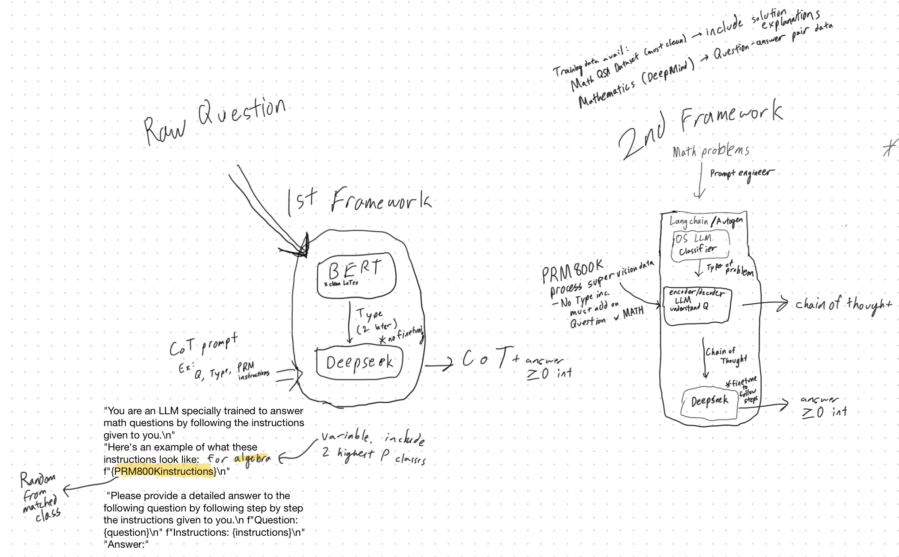

LLM powered math solver for the AIMO Kaggle Competition with DeepSeekMath and BERT.

## Overview of the App

- Accepts input text question with LaTex (*e.g.* `We roll a fair 6-sided die 5 times.  What is the probability that we get a 6 in at most 2 of the rolls?`) as prompt input, then classify problem type using a BERT-based LLM, then pass the question, type, and a random example from prm800k dataset (a series of steps for a random question of that question type) into an Autogen framework with DeepSeekMath and a coding LLM (DeepSeekCoder or OpenCodeInterpreter)
- The two LLMs converse with each other to verify each other's solution, and outputs an integer value answer.
- DeepSeekMath focuses on chain-of-thought series of steps, while DeepSeekCoder or OpenCodeInterpreter focus on generating executable Python code for the calculations

