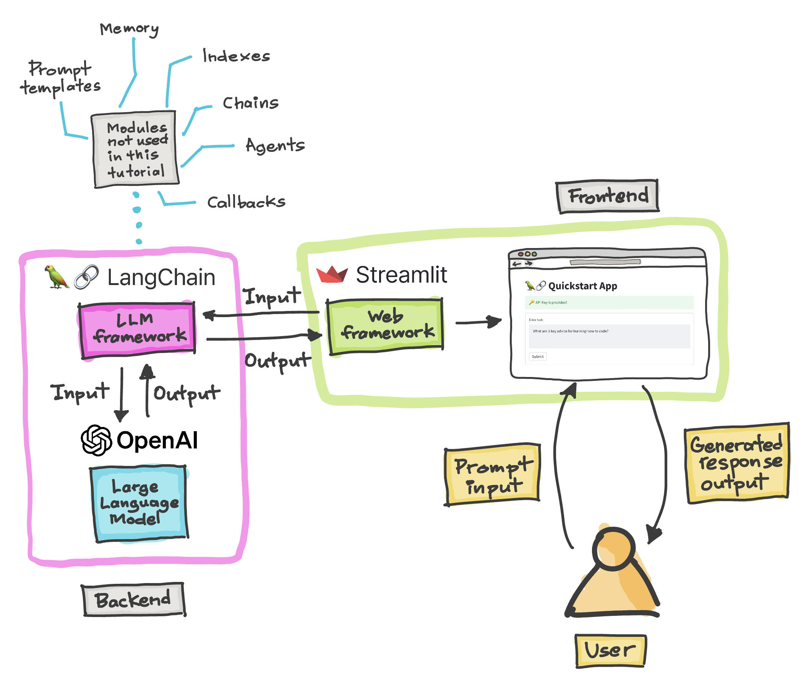

LLM powered math solver for the AIMO Kaggle Competition with Langchain.

## Overview of the App

- Accepts input text (*e.g.* `What are the three key pieces of advice for learning how to code?`) as prompt input using Streamlit's `st.text_area()`, then assign this to the `text` variable.
- LLM model is called via `llm()` and it is applied on the prompt input `text` to generate a response via `llm(text)`

