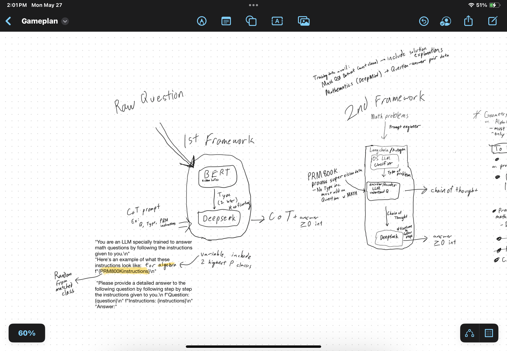

LLM powered math solver for the AIMO Kaggle Competition with Langchain.

## Overview of the App

- Accepts input text question with LaTex (*e.g.* `We roll a fair 6-sided die 5 times.  What is the probability that we get a 6 in at most 2 of the rolls?`) as prompt input, then classify problem type using a BERT-based LLM, then pass the question, type, and a random example from prm800k dataset (a series of steps for a random question of that question type) as a one shot inference to DeepSeekMath.
- DeepSeekMath outputs response as integer value, and a series of steps

